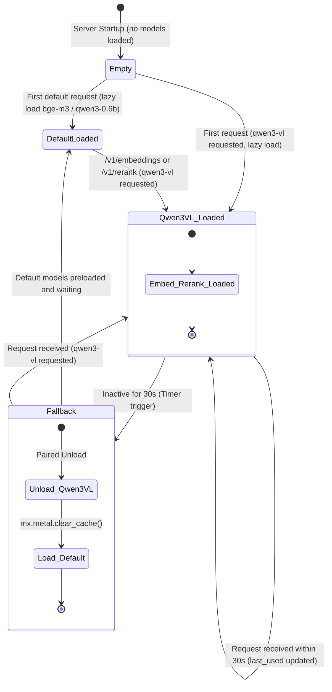
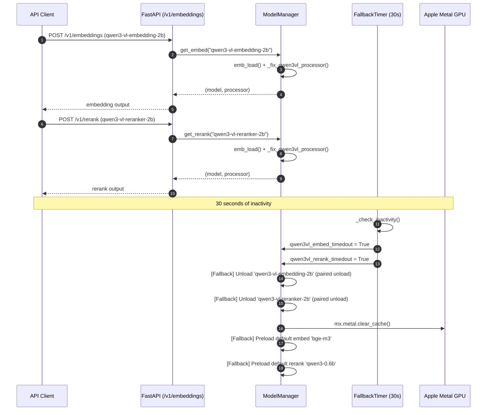

# MLX Embedding & Reranker Server

English | [日本語](README_JA.md)

A lightweight API server providing both high-accuracy Embedding and Reranking capabilities on a **single FastAPI process and port**, optimized with a native **MLX** backend for Apple Silicon.

It is designed to run independently from your LLM server (e.g., LM Studio, Ollama) as a dedicated **Embedding / Reranking engine** for Retrieval-Augmented Generation (RAG) workflows.

### 🚀 Default Models
The server uses the following highly-efficient models as defaults (used when no `model` is specified):
- **Embedding**: `bge-m3` (*bge-m3-mlx-fp16*)
- **Reranker**: `qwen3-0.6b` (*Qwen3-Reranker-0.6B-mxfp8*)

Models are **lazily loaded on the first request** (not at startup). After a heavy multimodal Qwen3-VL model is unloaded due to inactivity, these default models are automatically preloaded and kept warm.
*(Heavy multimodal models like Qwen3-VL-2B are loaded dynamically on demand and unloaded automatically.)*

---

## ✨ Features

- ✅ **Unified Process & Port**: Integrates Embedding and Reranking into a single FastAPI process (port `1235` by default).
- ✅ **OpenAI-Compatible API**: `/v1/embeddings` endpoint supports OpenAI-compatible input structure.
- ✅ **Apple Silicon Native**: Powered by Apple's MLX library for high-speed GPU-accelerated inference on Mac hardware.
- ✅ **State-of-the-Art Models**: Supports highly capable models like Gemma 3 300M, BGE-M3, and Qwen3-0.6B.
- ✅ **Multimodal Capabilities**: Supports Qwen3-VL Embedding/Reranker (2B) models with `instruction` parameters.
- ✅ **Smart Auto-Fallback**: Unloads heavy multimodal Qwen3-VL models after 30 seconds of inactivity, clearing the Metal cache and preloading lightweight default models to optimize GPU memory usage.
- ✅ **Zero GGUF Overhead**: Runs directly using MLX community weights without needing GGUF conversions.
- ✅ **Ready for Integration**: Easily plugs into Open WebUI, Dify, LangChain, or custom RAG pipelines.

---

## 🧠 API Specifications

### Base URL
```
http://localhost:1235
```

### Endpoints

| Method | Path            | Description |
|:-------|:----------------|:------------|
| `GET`  | `/health`        | Health check, returning loaded and available models. |
| `POST` | `/v1/embeddings` | Generates text/image embeddings (OpenAI-compatible). |
| `POST` | `/v1/rerank`     | Re-ranks query and document pairs. |

---

## ⏱️ Auto-Fallback (Smart Memory Management)

To optimize unified memory on Mac hardware, heavy multimodal Qwen3-VL models (`qwen3-vl-embedding-2b` / `qwen3-vl-reranker-2b`) are **automatically unloaded after 30 seconds of inactivity**.

- **Paired Unload**: If either model becomes inactive, both Qwen3-VL models are unloaded together to prevent resource leaks.
- **Default Preloading**: Simultaneously preloads the lightweight default models (`bge-m3` and `qwen3-0.6b`) to ensure instant availability for standard queries.
- **Immediate GPU Memory Release**: Calls `mx.metal.clear_cache()` upon unloading to immediately free system/unified memory.

### Model State Transition Diagram



### Fallback Sequence



---

## 🔧 Available Models (MLX)

You can select a model by passing the `model` parameter in your API request. If omitted, the default model will be loaded.

### Embedding (Default: `bge-m3`)
| Model ID | Hugging Face Model | Description / Strengths |
| :--- | :--- | :--- |
| `gemma-3-300m` | `embeddinggemma-300m-bf16` | Latest Gemma 3, fast & accurate with automatic prefix handling. |
| `bge-m3` | `bge-m3-mlx-fp16` | Robust multilingual model, standard choice for RAG. |
| `qwen3-0.6b-embed` | `Qwen3-Embedding-0.6B-mxfp8` | Qwen3 embedding (text only), high quality. |
| `qwen3-vl-embedding-2b` | `Qwen3-VL-Embedding-2B-mxfp8` | Multimodal embedding, supports instructions. |

### Reranker (Default: `qwen3-0.6b`)
| Model ID | Hugging Face Model | Description / Strengths |
| :--- | :--- | :--- |
| `qwen3-0.6b` | `Qwen3-Reranker-0.6B-mxfp8` | Generative cross-encoder (Yes/No), highly accurate. |
| `qwen3-vl-reranker-2b` | `Qwen3-VL-Reranker-2B-mxfp8` | Multimodal reranking, supports instructions. |

---

## 📦 Directory Structure

```text
mlx-embed-rerank-server/
├── mlx_embed_rerank_server.py   # Main FastAPI server
├── run_mlx_server.sh            # Process management / startup script
├── pyproject.toml               # Dependencies and uv configuration
├── README.md                    # Main documentation (English)
├── README_JA.md                 # Documentation in Japanese
├── LICENSE                      # MIT License
├── test-tools/                  # Ad-hoc scripts for quick tests
│   ├── test_mlx.py
│   └── test_infer.py
├── tests/
│   ├── test_api.py              # Automated integration tests (pytest)
│   └── data/
│       └── test_cases.json      # Test cases and expected outputs
└── ...
```

---

## 🐍 Requirements

- macOS (Apple Silicon required)
- Python **3.13 (Recommended)**
- Apple MLX installed

---

## 📥 Setup & Installation

We recommend using `uv` for seamless dependency and environment management.

### 1. Install Dependencies
```bash
uv sync
```

---

## ▶️ Running the Server

Start the server using the provided shell script:
```bash
./run_mlx_server.sh
```

Upon successful startup, the server logs:
```
Uvicorn running on http://0.0.0.0:1235
```

### 🛡️ Supervisor & Auto-Restart
The `run_mlx_server.sh` script runs as a foreground supervisor to ensure high availability:
- **Health Monitoring**: It pings the `/health` endpoint every 30 seconds to check server responsiveness.
- **Hang Detection & Auto-Restart**: If the server fails to respond within 10 seconds for **2 consecutive checks** (a ~60-second unresponsiveness window), the supervisor considers it a hang state, safely kills the process, and automatically restarts the server.
- **Grace Period**: This 2-strike system provides a grace period, preventing false positives and unwanted restarts while the server is legitimately busy loading heavy models (like Qwen3-VL) or processing massive Rerank requests.

---

## 🧪 Verification & Usage Examples

### Health Check
```bash
curl http://localhost:1235/health
```

### Generating Embeddings
```bash
curl http://localhost:1235/v1/embeddings \
  -H "Content-Type: application/json" \
  -d '{"input": "Testing embeddings", "input_type": "query"}'
```

#### With Custom Instructions (for Qwen3-VL)
```bash
curl http://localhost:1235/v1/embeddings \
  -H "Content-Type: application/json" \
  -d '{
    "model": "qwen3-vl-embedding-2b",
    "input": ["Text snippet 1", "Text snippet 2"],
    "input_type": "document",
    "instruction": "Represent this document for retrieval."
  }'
```

### Reranking Documents
```bash
curl http://localhost:1235/v1/rerank \
  -H "Content-Type: application/json" \
  -d '{
    "query": "SATA DOM recovery procedure",
    "documents": [
      "Replacing SATA DOM and reinstalling OS",
      "Increasing RAM capacity",
      "Precautions for RAID rebuild"
    ],
    "top_k": 2
  }'
```

#### Rerank with Custom Instructions (for Qwen3-VL)
```bash
curl http://localhost:1235/v1/rerank \
  -H "Content-Type: application/json" \
  -d '{
    "model": "qwen3-vl-reranker-2b",
    "query": "Cat photos",
    "documents": ["walking the dog", "sleeping cat", "flying bird"],
    "instruction": "Retrieve images or text relevant to the user'"'"'s query."
  }'
```

---

## 🧪 Automated Testing

Ensure your server is running, then execute the integration tests:

```bash
# Sync dev dependencies
uv sync --extra dev

# Run tests
uv run pytest tests/
```

The test suite validates:
- `/health`: Available model definitions.
- `/v1/embeddings`: Dimensional correctness & normalization verification for `gemma-3-300m`, `bge-m3`, and `qwen3-vl-embedding-2b`.
- `/v1/rerank`: Re-ranking scores and logical ranking correctness for `qwen3-0.6b` and `qwen3-vl-reranker-2b`.

---

## 💡 RAG Architecture Example

1. **Embed**: Vectorize your documents using `/v1/embeddings`.
2. **Retrieve**: Fetch the top 50–100 candidate documents from your vector database.
3. **Rerank**: Use `/v1/rerank` to narrow them down to the top 10–20 highest-quality context documents.
4. **Generate**: Pass the ranked documents as context to your LLM.

### Co-existence with LLM Servers

| Role | Port / Base URL |
| :--- | :--- |
| **LLM Server** (LM Studio / Ollama) | `http://localhost:1234/v1` |
| **Embed & Rerank Server** (this repo) | `http://localhost:1235` |

---

## 📜 License / Credits

- **License**: MIT License (See [LICENSE](LICENSE) for details)
- Models: [mlx-community](https://huggingface.co/mlx-community) / Google / BAAI / Qwen
- Powered by [Apple MLX](https://github.com/ml-explore/mlx) and FastAPI
