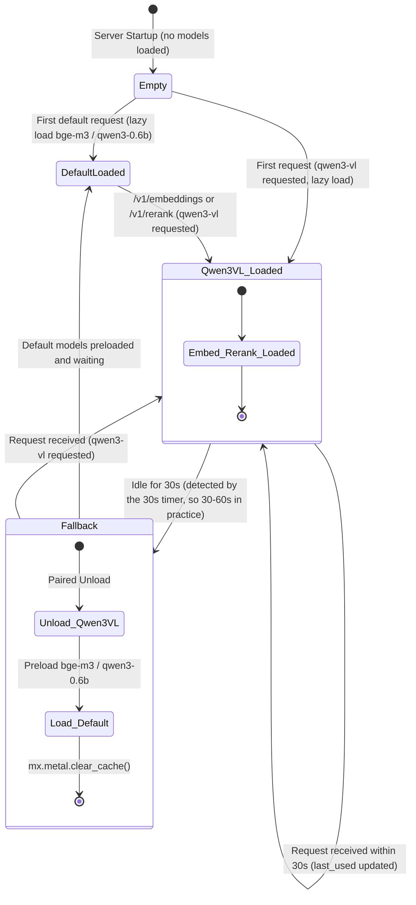
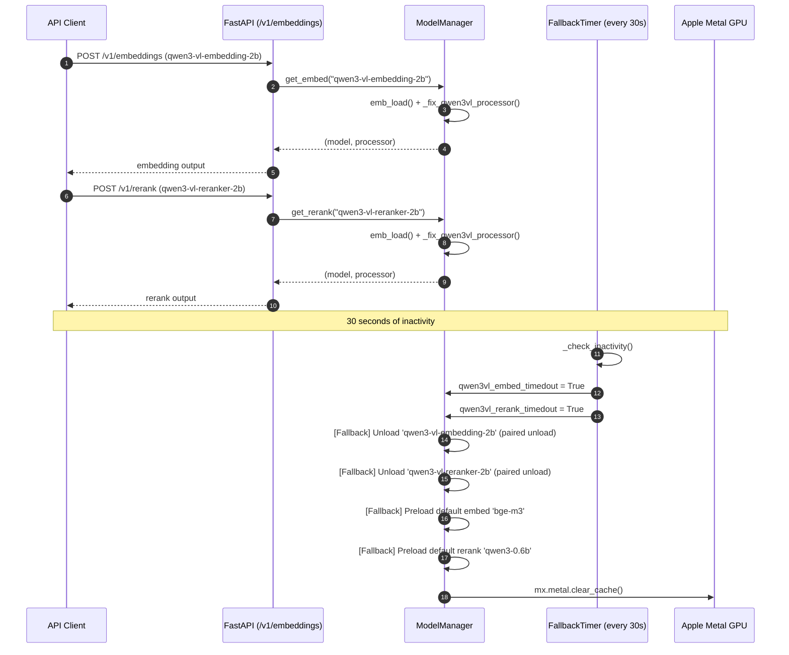

# MLX Embedding & Reranker Server

English | [日本語](README_JA.md)

A lightweight API server providing high-accuracy **Embedding**, **Reranking**, **STT** and **TTS** capabilities on a **single FastAPI process and port**, optimized with a native **MLX** backend for Apple Silicon.

It is designed to run independently from your LLM server (e.g., LM Studio, Ollama) as a dedicated **Embedding / Reranking / Audio engine** for Retrieval-Augmented Generation (RAG) workflows.

### 🚀 Default Models
The server uses the following models as defaults (used when no `model` is specified). The selection is based on the measurements in [BENCHMARK_REPORT.md](BENCHMARK_REPORT.md):
- **Embedding**: `bge-m3` (*bge-m3-mlx-fp16*)
- **Reranker**: `qwen3-0.6b` (*Qwen3-Reranker-0.6B-mxfp8*)
- **ASR (STT)**: `qwen3-asr-1.7b-8bit` (*Qwen3-ASR-1.7B-8bit*)
- **TTS**: `qwen3-tts-0.6b-base-8bit` (*Qwen3-TTS-12Hz-0.6B-Base-8bit*)

Models are **lazily loaded on the first request** (not at startup). After a heavy multimodal Qwen3-VL model is unloaded due to inactivity, the default embedding/rerank models are automatically preloaded and kept warm.
*(Heavy multimodal models like Qwen3-VL-2B are loaded dynamically on demand and unloaded automatically.)*

---

## ✨ Features

- ✅ **Unified Process & Port**: Integrates Embedding, Reranking and Audio into a single FastAPI process (API port `1235`, dedicated health port `1236`).
- ✅ **OpenAI-Compatible API**: `/v1/embeddings`, `/v1/audio/transcriptions` and `/v1/audio/speech` follow OpenAI's request/response shapes.
- ✅ **Apple Silicon Native**: Powered by Apple's MLX library for GPU-accelerated inference on Mac hardware.
- ✅ **Multiple Models per Task**: 5 embedding models, 2 rerankers and 4 audio models selectable per request.
- ✅ **Multimodal Models**: Qwen3-VL Embedding/Reranker (2B) with `instruction` support (requires `torch` / `torchvision`, see [Requirements](#-requirements)).
- ✅ **Audio Capabilities**: STT (`/v1/audio/transcriptions`) and TTS with voice cloning (`/v1/audio/speech`) powered by Qwen3-ASR/TTS models.
- ✅ **Smart Auto-Fallback**: Unloads heavy Qwen3-VL models after inactivity, clears the Metal cache and preloads the lightweight default models.
- ✅ **Hang-Resistant Supervisor**: A dedicated health server on a separate thread/port keeps responding while MLX inference blocks the main event loop.
- ✅ **Zero GGUF Overhead**: Runs directly using MLX community weights without needing GGUF conversions.
- ✅ **Ready for Integration**: Easily plugs into Open WebUI, Dify, LangChain, or custom RAG pipelines.

---

## 🧠 API Specifications

### Base URL
```
http://localhost:1235
```
A dedicated health-check server also listens on `http://localhost:1236` (see [Supervisor](#️-supervisor--auto-restart)).

### Endpoints

| Method | Path                    | Description |
|:-------|:------------------------|:------------|
| `GET`  | `/health`               | Health check, returning loaded and available models. |
| `POST` | `/v1/embeddings`        | Generates **text** embeddings (OpenAI-compatible). |
| `POST` | `/v1/rerank` (alias `/rerank`) | Re-ranks query and document pairs. |
| `POST` | `/v1/audio/transcriptions` | Transcribes audio files to text (STT, OpenAI-compatible). |
| `POST` | `/v1/audio/speech`      | Generates speech from text (TTS, OpenAI-compatible). |

> **Note**: image input is not exposed through the HTTP API. Even the Qwen3-VL models are served as text-only embedding / reranking endpoints; `input` accepts a string or a list of strings.

### `GET /health`

```json
{
  "status": "ok",
  "loaded_embed_models": [], "loaded_rerank_models": [],
  "loaded_asr_models": [], "loaded_tts_models": [],
  "available_embed": ["gemma-3-300m", "bge-m3", "bge-m3-8bit", "qwen3-vl-embedding-2b", "qwen3-0.6b-embed"],
  "available_rerank": ["qwen3-0.6b", "qwen3-vl-reranker-2b"],
  "available_audio": ["qwen3-asr-0.6b-8bit", "qwen3-asr-1.7b-8bit", "qwen3-tts-0.6b-base-8bit", "qwen3-tts-1.7b-base-8bit"]
}
```

### `POST /v1/embeddings`

| Field | Type | Default | Description |
|:---|:---|:---|:---|
| `input` | `string \| string[]` | – (required) | Text(s) to embed. |
| `model` | `string` | `bge-m3` | Embedding model ID. |
| `input_type` | `"query" \| "document"` | `"document"` | Selects the automatic prefix for `gemma-3-300m` and the default instruction for `qwen3-vl-embedding-2b`. |
| `instruction` | `string` | `null` | **Used by `qwen3-vl-embedding-2b` only.** Ignored by every other embedding model. |

**Output vectors**: all embedding models return the first token of `last_hidden_state` (CLS pooling), L2-normalized to unit length. This matches the BGE-M3 dense-embedding specification, which is why `bge-m3` is the default and the recommended choice for Japanese RAG — see [Model Selection](#-model-selection-guidance).

### `POST /v1/rerank` (alias `POST /rerank`)

| Field | Type | Default | Description |
|:---|:---|:---|:---|
| `query` | `string` | – (required) | Search query. |
| `documents` | `string[]` | – (required) | Candidate documents. |
| `model` | `string` | `qwen3-0.6b` | Reranker model ID. |
| `top_k` | `int` | `10` | Number of results to return. `0` returns every document. |
| `instruction` | `string` | `null` | **Used by `qwen3-vl-reranker-2b` only.** `qwen3-0.6b` uses its own fixed yes/no judging prompt and ignores this field. |

The response contains `{"model": ..., "results": [{"index": ..., "relevance_score": ...}, ...]}` sorted by descending score. For `qwen3-0.6b` the score is the softmax probability of the `yes` token against the `no` token, so absolute values are typically small; the **ranking**, not the magnitude, is the signal.

### Error responses

| Situation | Endpoint | Status |
|:---|:---|:---|
| Unknown model name | `/v1/rerank`, `/v1/audio/*` | `400` with a short detail message |
| Unknown model name | `/v1/embeddings` | `500` — `compute_embeddings` runs inside a catch-all handler that wraps every exception, including the internal 400 |
| Inference failure | `/v1/embeddings` | `500` with the full Python traceback in `detail` (intended for local debugging; do not expose the port publicly) |
| Inference failure | `/v1/rerank` | `500` `Internal Server Error` (no traceback; check the server log) |

---

## ⏱️ Auto-Fallback (Smart Memory Management)

To optimize unified memory on Mac hardware, heavy multimodal Qwen3-VL models (`qwen3-vl-embedding-2b` / `qwen3-vl-reranker-2b`) are **automatically unloaded once they have been idle for 30 seconds**.

- **Timer Granularity**: a repeating 30-second timer checks the idle time, so the actual release happens between 30 and 60 seconds after the last request.
- **Paired Unload**: If either model becomes inactive, both Qwen3-VL models are unloaded together to prevent resource leaks.
- **Default Preloading**: Simultaneously preloads the lightweight default models (`bge-m3` and `qwen3-0.6b`) to ensure instant availability for standard queries.
- **Immediate GPU Memory Release**: `mx.metal.clear_cache()` is called at the end of the fallback (after unloading and preloading) to free unified memory.
- **Audio models are exempt**: ASR/TTS models stay resident once loaded — the 0.6B/1.7B class is small enough that unloading was judged unnecessary.

### Model State Transition Diagram


```mermaid
stateDiagram-v2
    [*] --> Empty : Server Startup (no models loaded)
    Empty --> DefaultLoaded : First default request (lazy load bge-m3 / qwen3-0.6b)
    Empty --> Qwen3VL_Loaded : First request (qwen3-vl requested, lazy load)
    DefaultLoaded --> Qwen3VL_Loaded : /v1/embeddings or /v1/rerank (qwen3-vl requested)
    Qwen3VL_Loaded --> Qwen3VL_Loaded : Request received within 30s (last_used updated)
    Qwen3VL_Loaded --> Fallback : Idle for 30s (detected by the 30s timer, so 30-60s in practice)
    Fallback --> DefaultLoaded : Default models preloaded and waiting
    Fallback --> Qwen3VL_Loaded : Request received (qwen3-vl requested)

    state Qwen3VL_Loaded {
        [*] --> Embed_Rerank_Loaded
        Embed_Rerank_Loaded --> [*]
    }

    state Fallback {
        [*] --> Unload_Qwen3VL : Paired Unload
        Unload_Qwen3VL --> Load_Default : Preload bge-m3 / qwen3-0.6b
        Load_Default --> [*] : mx.metal.clear_cache()
    }
```

### Fallback Sequence


```mermaid
sequenceDiagram
    autonumber
    participant Client as API Client
    participant API as FastAPI (/v1/embeddings)
    participant MM as ModelManager
    participant Timer as FallbackTimer (every 30s)
    participant GPU as Apple Metal GPU

    Client->>API: POST /v1/embeddings (qwen3-vl-embedding-2b)
    API->>MM: get_embed("qwen3-vl-embedding-2b")
    MM->>MM: emb_load() + _fix_qwen3vl_processor()
    MM-->>API: (model, processor)
    API-->>Client: embedding output

    Client->>API: POST /v1/rerank (qwen3-vl-reranker-2b)
    API->>MM: get_rerank("qwen3-vl-reranker-2b")
    MM->>MM: emb_load() + _fix_qwen3vl_processor()
    MM-->>API: (model, processor)
    API-->>Client: rerank output

    Note over Client,GPU: 30 seconds of inactivity

    Timer->>Timer: _check_inactivity()
    Timer->>MM: qwen3vl_embed_timedout = True
    Timer->>MM: qwen3vl_rerank_timedout = True

    MM->>MM: [Fallback] Unload 'qwen3-vl-embedding-2b' (paired unload)
    MM->>MM: [Fallback] Unload 'qwen3-vl-reranker-2b' (paired unload)
    MM->>MM: [Fallback] Preload default embed 'bge-m3'
    MM->>MM: [Fallback] Preload default rerank 'qwen3-0.6b'
    MM->>GPU: mx.metal.clear_cache()
```

---

## 🔧 Available Models (MLX)

You can select a model by passing the `model` parameter in your API request. If omitted, the default model will be loaded.

### Embedding (Default: `bge-m3`)
| Model ID | Hugging Face Model | Description / Strengths |
| :--- | :--- | :--- |
| `gemma-3-300m` | `embeddinggemma-300m-bf16` | Gemma 3, fastest option, automatic `query`/`document` prefix handling. |
| `bge-m3` | `bge-m3-mlx-fp16` | Robust multilingual model, **recommended default** for Japanese RAG. |
| `bge-m3-8bit` | `bge-m3-mlx-8bit` | BGE-M3 8-bit quantized, memory-efficient multilingual model. |
| `qwen3-0.6b-embed` | `Qwen3-Embedding-0.6B-mxfp8` | Qwen3 embedding (text only). |
| `qwen3-vl-embedding-2b` | `Qwen3-VL-Embedding-2B-mxfp8` | 2B multimodal backbone, supports `instruction`; highest recall, slowest. |

### Reranker (Default: `qwen3-0.6b`)
| Model ID | Hugging Face Model | Description / Strengths |
| :--- | :--- | :--- |
| `qwen3-0.6b` | `Qwen3-Reranker-0.6B-mxfp8` | Generative cross-encoder (Yes/No logits), fast and accurate. |
| `qwen3-vl-reranker-2b` | `Qwen3-VL-Reranker-2B-mxfp8` | 2B multimodal reranking, supports `instruction`. |

### Audio (STT Default: `qwen3-asr-1.7b-8bit` / TTS Default: `qwen3-tts-0.6b-base-8bit`)
| Model ID | Hugging Face Model | Description / Strengths |
| :--- | :--- | :--- |
| `qwen3-asr-0.6b-8bit` | `Qwen3-ASR-0.6B-8bit` | Speech-to-Text (ASR), fastest (65.8x realtime). |
| `qwen3-asr-1.7b-8bit` | `Qwen3-ASR-1.7B-8bit` | Speech-to-Text (ASR), best accuracy (43.9x realtime, default). |
| `qwen3-tts-0.6b-base-8bit` | `Qwen3-TTS-12Hz-0.6B-Base-8bit` | Text-to-Speech (TTS), voice cloning, fast load (default). |
| `qwen3-tts-1.7b-base-8bit` | `Qwen3-TTS-12Hz-1.7B-Base-8bit` | Text-to-Speech (TTS), most stable speech tempo. |

4-bit variants were evaluated and dropped; all shipped audio models are 8-bit. See [BENCHMARK_REPORT.md](BENCHMARK_REPORT.md) §5.6 / §6.5.

---

## 🎯 Model Selection Guidance

Measured on 1000 Japanese documents indexed in ChromaDB ([BENCHMARK_REPORT.md](BENCHMARK_REPORT.md) §2–§4):

| Model | 1000 docs (cached) | Per document | Retrieval note |
| :--- | ---: | ---: | :--- |
| `gemma-3-300m` | 2.93 s | ~2.9 ms | Fastest, but the target document was sometimes missing from the top-100 |
| `bge-m3` | 6.10 s | ~6.1 ms | **Recall 100%** in the same test — the default |
| `qwen3-0.6b-embed` | 9.42 s | ~9.4 ms | Same top-100 misses as `gemma-3-300m` |
| `qwen3-vl-embedding-2b` | 37.74 s | ~37.7 ms | Recall 100%, heaviest |

**Rule of thumb**: use `bge-m3` for retrieval quality (or `bge-m3-8bit` when memory is tight), then rerank the top 100 with `qwen3-0.6b` (~2 s for 100 documents). Reserve `gemma-3-300m` for latency-critical, precision-tolerant workloads, and Qwen3-VL for offline high-accuracy evaluation.

---

## 📊 Performance Summary

| Task | Model | Measurement |
| :--- | :--- | :--- |
| Embedding | `bge-m3` | 1000 docs in 6.10 s (cached) |
| Rerank | `qwen3-0.6b` | top-100 in ~2.0 s (~20 ms/doc) |
| STT | `qwen3-asr-1.7b-8bit` | 32.9 s audio in 0.75 s (43.9x realtime) |
| TTS | `qwen3-tts-0.6b-base-8bit` | 3.31 s average generation (4.1x realtime) |

Full methodology, per-run numbers and accuracy comparisons: [BENCHMARK_REPORT.md](BENCHMARK_REPORT.md).

---

## 📦 Directory Structure

```text
embed_reranker/
├── mlx_embed_rerank_server.py   # Main FastAPI server (API 1235 + health 1236)
├── run_mlx_server.sh            # Supervisor / process management script
├── pyproject.toml               # Dependencies and uv configuration
├── README.md                    # Main documentation (English)
├── README_JA.md                 # Documentation in Japanese
├── GEMINI.md                    # Condensed project context for AI agents
├── BENCHMARK_REPORT.md          # Benchmark results (embedding / rerank / STT / TTS)
├── MIGRATION_SUMMARY.md         # uv & MLX migration history
├── AUTO_STARTUP_SUMMARY.md      # launchd auto-start setup
├── PLAN_STT_TTS_REVIEW.md       # Historical design review for the audio endpoints
├── TODO.md                      # Backlog
├── LICENSE                      # MIT License
├── scripts/
│   ├── rag_pipeline_chromadb.py # End-to-end RAG benchmark against ChromaDB
│   └── benchmark_100_sentences.py
├── test-tools/                  # Ad-hoc scripts for quick tests
│   ├── test_mlx.py
│   └── test_infer.py
└── tests/                       # pytest integration suite (see tests/TEST_DESIGN.md)
    ├── TEST_DESIGN.md           # Test design: scope, cases, markers, maintenance
    ├── conftest.py              # Fixtures, markers, helpers
    ├── test_health.py           # /health (1235) + supervisor probe (1236)
    ├── test_embeddings.py       # POST /v1/embeddings
    ├── test_rerank.py           # POST /v1/rerank and /rerank
    ├── test_audio.py            # POST /v1/audio/* (marker: audio)
    ├── test_errors.py           # Error codes and request validation
    └── data/
        ├── test_cases.json      # All expected values
        └── asr_output.txt
```

---

## 🐍 Requirements

- macOS (Apple Silicon required)
- Python **3.13 (Recommended)**
- Apple MLX installed
- **ffmpeg** (for audio file processing with mp4/m4a/webm support): `brew install ffmpeg`
- **`torch` / `torchvision` for the Qwen3-VL models only.** They are *not* declared in `pyproject.toml`; without them `transformers`' `AutoImageProcessor` raises and any request for `qwen3-vl-embedding-2b` / `qwen3-vl-reranker-2b` fails with HTTP 500. Install them explicitly if you need those models:
  ```bash
  uv pip install torch torchvision
  ```
  Every other model (bge-m3, gemma, qwen3 embed/rerank, ASR, TTS) runs without them.

---

## 📥 Setup & Installation

We recommend using `uv` for seamless dependency and environment management.

### 1. Install Dependencies
```bash
uv sync
```

---

## ▶️ Running the Server

Start the server using the provided shell script:
```bash
./run_mlx_server.sh
```

Upon successful startup, the server logs:
```
Health-check server started on port 1236
Uvicorn running on http://0.0.0.0:1235
```

Management subcommands:
```bash
./run_mlx_server.sh status    # Running state + loaded models (via /health on 1235)
./run_mlx_server.sh restart
./run_mlx_server.sh kill      # Stops the process on port 1235
```

### 🛡️ Supervisor & Auto-Restart
The `run_mlx_server.sh` script runs as a foreground supervisor to ensure high availability:
- **Dedicated Health Port**: MLX inference runs synchronously and blocks uvicorn's event loop, so the server also starts a lightweight `http.server` on **port 1236** in a daemon thread. The supervisor polls `http://localhost:1236/health` — not port 1235 — so a long TTS/ASR request is never mistaken for a hang. (Background: [BENCHMARK_REPORT.md](BENCHMARK_REPORT.md) §6.6, where 10 consecutive TTS requests used to trigger spurious restarts.)
- **Health Monitoring**: Polls every 30 seconds with a 10-second curl timeout.
- **Hang Detection & Auto-Restart**: **2 consecutive failures** (a ~60-second unresponsiveness window) are treated as a hang; the supervisor kills whatever holds port 1235 and restarts the server.
- **Grace Period**: The 2-strike system prevents false positives while heavy models (like Qwen3-VL) are loading.
- **Trade-off**: because the probe lives in a separate thread of the same process, it reports `ok` whenever the process is alive. It detects a dead or wedged process, not a stuck event loop.

### Automated Startup (macOS launchd)
See [AUTO_STARTUP_SUMMARY.md](AUTO_STARTUP_SUMMARY.md). `~/Library/LaunchAgents/com.norihito.embed-reranker.plist` runs this script at login with `KeepAlive`.

---

## 🧪 Verification & Usage Examples

### Health Check
```bash
curl http://localhost:1235/health   # full status incl. loaded models
curl http://localhost:1236/health   # supervisor probe: {"status": "ok"}
```

### Generating Embeddings
```bash
curl http://localhost:1235/v1/embeddings \
  -H "Content-Type: application/json" \
  -d '{"input": "Testing embeddings", "input_type": "query"}'
```

#### With Custom Instructions (Qwen3-VL only)
```bash
curl http://localhost:1235/v1/embeddings \
  -H "Content-Type: application/json" \
  -d '{
    "model": "qwen3-vl-embedding-2b",
    "input": ["Text snippet 1", "Text snippet 2"],
    "input_type": "document",
    "instruction": "Represent this document for retrieval."
  }'
```

### Reranking Documents
```bash
curl http://localhost:1235/v1/rerank \
  -H "Content-Type: application/json" \
  -d '{
    "query": "SATA DOM recovery procedure",
    "documents": [
      "Replacing SATA DOM and reinstalling OS",
      "Increasing RAM capacity",
      "Precautions for RAID rebuild"
    ],
    "top_k": 2
  }'
```

#### Rerank with Custom Instructions (Qwen3-VL only)
```bash
curl http://localhost:1235/v1/rerank \
  -H "Content-Type: application/json" \
  -d '{
    "model": "qwen3-vl-reranker-2b",
    "query": "Cat photos",
    "documents": ["walking the dog", "sleeping cat", "flying bird"],
    "instruction": "Retrieve images or text relevant to the user'"'"'s query."
  }'
```

### Speech-to-Text (STT)
```bash
# Transcribe an audio file (wav, mp3, mp4, m4a, etc.)
curl -X POST http://localhost:1235/v1/audio/transcriptions \
  -F file="@sample.wav" \
  -F model="qwen3-asr-1.7b-8bit" \
  -F language="en"
```
The uploaded bytes are written to a temporary file under `/tmp` (preserving the original extension) and the path is handed to the model, because piping m4a/mp4 through stdin breaks ffmpeg's seek for trailing `moov` atoms. The temporary file is always removed afterwards. Response: `{"text": "..."}`.

### Text-to-Speech (TTS)
```bash
# Generate speech from text (mp3, wav, flac, ogg)
curl -X POST http://localhost:1235/v1/audio/speech \
  -H "Content-Type: application/json" \
  -d '{
    "input": "Hello, this is a test.",
    "model": "qwen3-tts-0.6b-base-8bit",
    "voice": "Chelsie",
    "response_format": "mp3"
  }' \
  --output speech.mp3
```

`response_format` maps to `audio/mpeg` (mp3), `audio/wav` (wav), `audio/flac` (flac) and `audio/ogg` (ogg); anything else falls back to `audio/mpeg`. `voice`, `speed`, `ref_audio` and `ref_text` are forwarded to the model only when set (`speed` only when it differs from `1.0`).

#### TTS with Voice Cloning
```bash
# Clone a voice from a reference audio file
curl -X POST http://localhost:1235/v1/audio/speech \
  -H "Content-Type: application/json" \
  -d '{
    "input": "This is a cloned voice.",
    "model": "qwen3-tts-0.6b-base-8bit",
    "ref_audio": "/path/to/reference.wav",
    "ref_text": "Reference audio transcript",
    "response_format": "wav"
  }' \
  --output cloned.wav
```

`ref_audio` must be a path **on the server host** (client-side upload is not implemented). Keep the reference clip to roughly **5–15 seconds**: longer clips make ICL encoding slow enough to matter ([BENCHMARK_REPORT.md](BENCHMARK_REPORT.md) §6.5).

---

## 🧪 Automated Testing

Ensure your server is running, then execute the integration tests:

```bash
# Sync dev dependencies
uv sync --extra dev

# Run tests
uv run pytest tests/
```

Everything is an **API integration test** against the running server — nothing is mocked. The full design (scope, case list, what is deliberately *not* covered) is in [tests/TEST_DESIGN.md](tests/TEST_DESIGN.md).

| File | Covers |
| :--- | :--- |
| `tests/test_health.py` | `/health` payload, defaults, and the port-1236 supervisor probe |
| `tests/test_embeddings.py` | All 5 models: dimensions, unit norm, OpenAI envelope, default model, string vs list input, determinism, `input_type` prefix behaviour, `instruction` being VL-only, semantic sanity |
| `tests/test_rerank.py` | Both rerankers: response shape, descending order, expected winner, score range, `/rerank` alias, `top_k` (default / limit / `0` = all / oversized), empty documents, determinism, `instruction` ignored by `qwen3-0.6b` |
| `tests/test_audio.py` | STT JSON shape, `/tmp` cleanup, TTS content-type / RIFF header / defaults, audio models staying resident |
| `tests/test_errors.py` | The asymmetric error codes (embeddings 500 vs rerank/audio 400), wrong model type, 422 validation, 404 |

Markers (registered in `pyproject.toml`, `--strict-markers` is on):

```bash
uv run pytest tests/                  # everything
uv run pytest tests/ -m "not audio"   # skip the slow STT/TTS tests
uv run pytest tests/ -m audio         # only STT/TTS
```

Notes:
- Expected values live in `tests/data/test_cases.json`. When you add or remove a model in `AVAILABLE_*_MODELS`, update `expected_embed_models` / `expected_rerank_models` / `expected_audio_models` or the `/health` assertion will fail.
- `vl`-marked tests are skipped automatically unless `torch` / `torchvision` are installed (see [Requirements](#-requirements)).
- If the server is not running, the whole suite skips instead of erroring.

---

## 💡 RAG Architecture Example

1. **Embed**: Vectorize your documents using `/v1/embeddings` with `bge-m3`.
2. **Retrieve**: Fetch the top 50–100 candidate documents from your vector database.
3. **Rerank**: Use `/v1/rerank` with `qwen3-0.6b` to narrow them down to the top 10–20 highest-quality context documents.
4. **Generate**: Pass the ranked documents as context to your LLM.

### Co-existence with LLM Servers

| Role | Port / Base URL |
| :--- | :--- |
| **LLM Server** (LM Studio / Ollama) | `http://localhost:1234/v1` |
| **Embed & Rerank Server** (this repo) | `http://localhost:1235` |
| **Health probe only** (this repo) | `http://localhost:1236/health` |

---

## 📜 License / Credits

- **License**: MIT License (See [LICENSE](LICENSE) for details)
- Models: [mlx-community](https://huggingface.co/mlx-community) / Google / BAAI / Qwen
- Powered by [Apple MLX](https://github.com/ml-explore/mlx) and FastAPI
