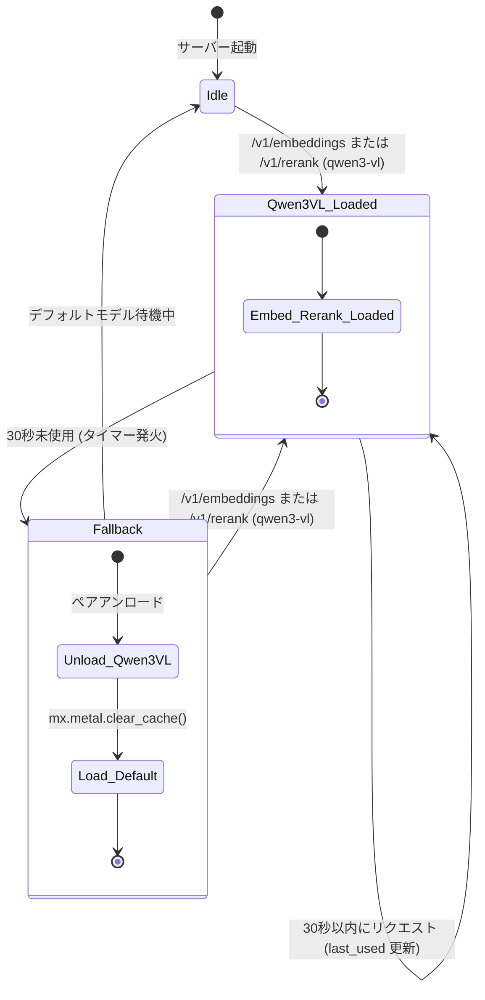
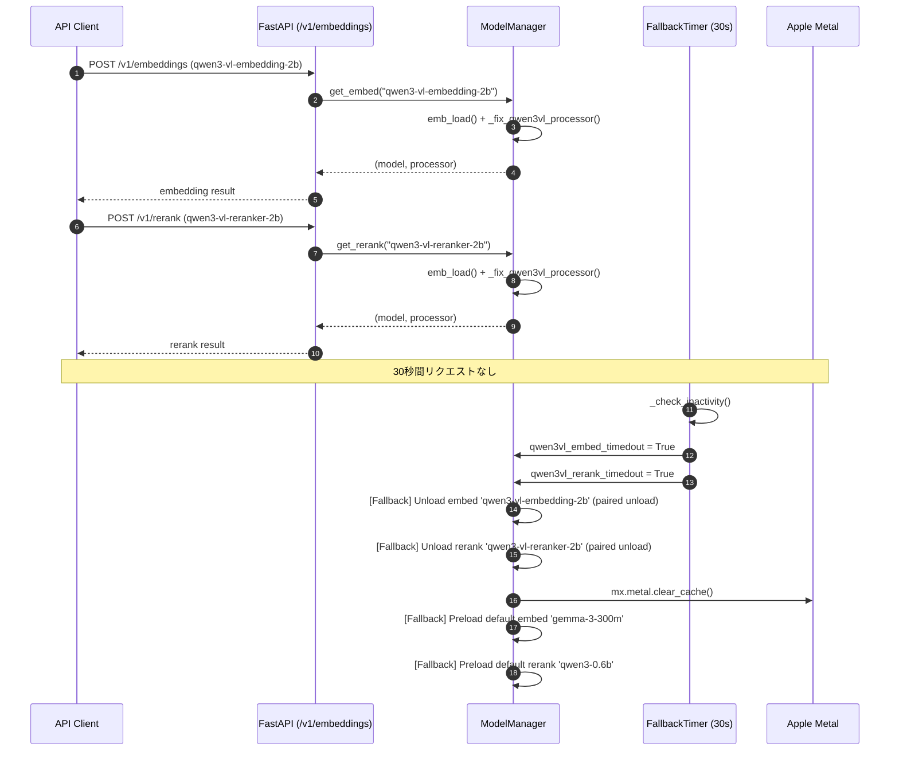

# MLX Embedding & Reranker Server

[English](README.md) | 日本語

Apple Silicon ネイティブの **MLX** バックエンドを利用し、  
高精度な Embedding モデルと Reranker モデルを  
**単一の FastAPI サーバ・単一ポート** で提供する軽量 API サーバです。

LLM 実行基盤（LM Studio 等）とは分離し、  
RAG 用の **Embedding / Rerank 専用エンジン** として動作します。

### 🚀 デフォルトロードモデル
サーバー起動時、メモリ効率が良く高速な以下のモデルが自動的にロードされます：
- **Embedding**: `gemma-3-300m` (*embedding-gemma-300m-bf16*)
- **Reranker**: `qwen3-0.6b` (*Qwen3-Reranker-0.6B-mxfp8*)
*(※ Qwen3-VL-2B などの重い VLM モデルは、リクエスト時のみロードされ、自動でメモリ解放されます)*

---

## ✨ 特徴

- ✅ Embedding と Rerank を **1 プロセス / 1 ポート** に統合
- ✅ OpenAI 互換風 API
- ✅ Apple Silicon ネイティブ **MLX** 高速推論
- ✅ 多言語対応（Gemma 3 300M, BGE-M3 等）
- ✅ マルチモーダル対応（Qwen3-VL Embedding/Reranker 2B）
- ✅ 自動フォールバック：Qwen3-VL モデルは 30 秒未使用で自動アンロードし、デフォルトモデルに戻る
- ✅ GGUF 不要
- ✅ OpenWebUI / 自作RAG / LangChain から利用可能

---

## 🧠 提供 API

### ベース URL

http://localhost:1235

### エンドポイント一覧

| Method | Path            | 説明 |
|------|------------------|------|
| GET  | `/health`        | ヘルスチェック |
| POST | `/v1/embeddings` | 日本語埋め込み生成 |
| POST | `/v1/rerank`     | クエリ＋文書の再ランキング |

---

## ⏱️ 自動フォールバック（Auto Fallback）

Qwen3-VL 系モデル（`qwen3-vl-embedding-2b` / `qwen3-vl-reranker-2b`）は **30 秒間リクエストがないと自動的にアンロード** されます。

- **ペアアンロード**: embed / rerank のどちらか一方が未使用でも、両方の Qwen3-VL モデルを同時に解放します（共有リソースを考慮）。
- **デフォルト自動ロード**: アンロードと同時に `gemma-3-300m`（Embed）および `qwen3-0.6b`（Rerank）を自動でプリロードします。
- **メモリ解放**: アンロード時に `mx.metal.clear_cache()` を実行し、GPU メタルメモリを即座に解放します。

この仕様により、Qwen3-VL の重いモデルを常時メモリに保持せず、軽量なデフォルトモデルが待機状態になります。

### モデル状態遷移図



### フォールバックシーケンス図



### メモリ状態の比較

| 状態 | ロード済み Embed | ロード済み Rerank | メモリ使用量 | 次のリクエスト |
|------|-----------------|------------------|-------------|--------------|
| **デフォルト待機** | `gemma-3-300m` | `qwen3-0.6b` | 低（軽量） | 即座に応答 |
| **Qwen3-VL 使用中** | `qwen3-vl-embedding-2b` | `qwen3-vl-reranker-2b` | 高（重い） | 即座に応答 |
| **Qwen3-VL → フォールバック** | `gemma-3-300m` | `qwen3-0.6b` | 低（解放済） | 即座に応答 |

---

## 🔧 利用可能なモデル (MLX)

リクエスト時の `model` パラメータで切り替え可能です。未指定時はデフォルトモデルが使用されます。

### Embedding (デフォルト: `gemma-3-300m`)
| ID | モデル名 (Hugging Face) | 特徴 |
| :--- | :--- | :--- |
| `gemma-3-300m` | `embedding-gemma-300m-bf16` | 最新 Gemma 3, プレフィックス自動付与 |
| `bge-m3` | `bge-m3-mlx-fp16` | 定番の多言語対応モデル |
| `qwen3-vl-embedding-2b` | `Qwen3-VL-Embedding-2B-mxfp8` | マルチモーダル, instruction 対応 |

### Reranker (デフォルト: `qwen3-0.6b`)
| ID | モデル名 (Hugging Face) | 特徴 |
| :--- | :--- | :--- |
| `qwen3-0.6b` | `Qwen3-Reranker-0.6B-mxfp8` | 生成型 (Yes/No), 高精度 |
| `qwen3-vl-reranker-2b` | `Qwen3-VL-Reranker-2B-mxfp8` | マルチモーダル, instruction 対応 |


---

## 📦 ディレクトリ構成

```
mlx-embed-rerank-server/
├── mlx_embed_rerank_server.py   # メインサーバー
├── run_mlx_server.sh            # 起動・管理スクリプト
├── pyproject.toml               # 依存関係 / uv 設定
├── README.md                    # 本ドキュメント (英語)
├── README_JA.md                 # 日本語ドキュメント
├── LICENSE                      # MIT ライセンス
├── test-tools/                  # 動作確認用スクリプト
│   ├── test_mlx.py
│   └── test_infer.py
├── tests/
│   ├── test_api.py              # pytest 統合テスト
│   └── data/
│       └── test_cases.json      # テストケースデータ
└── ...
```

---

## 🐍 動作環境

- Python **3.13（推奨）**
- macOS (Apple Silicon)
- **MLX 搭載**

---

## 📥 セットアップ

### 1. 依存関係インストール (uv 推奨)

```bash
uv sync
```

---

## ▶️ 起動方法

```bash
./run_mlx_server.sh
```

起動成功時：

```
Uvicorn running on http://0.0.0.0:1235
```

### 🛡️ スーパーバイザー監視機能（自動再起動）
起動スクリプト `run_mlx_server.sh` は、フォアグラウンドに常駐するスーパーバイザーとして動作します。
- **ヘルスチェック監視**: 30秒ごとに `/health` エンドポイントへアクセスし、サーバーの応答を確認します。
- **ハング検知と自動再起動**: 10秒のタイムアウトが「2回連続」で発生した場合（約60秒間無応答状態）、サーバーがハングしたと判定してプロセスを安全に終了し、**自動で再起動（Auto-Restart）** を行います。
- **Grace Period (猶予期間)**: 単一のタイムアウトで即座にキルせず2回の猶予を持たせることで、Qwen3-VLなどの重いモデルのロードや、長文のRerank推論中における誤検知を防ぎます。

---

## 🧪 動作確認（手動）

### Health Check

```bash
curl http://localhost:1235/health
```

### Embedding

```bash
curl http://localhost:1235/v1/embeddings \
  -H "Content-Type: application/json" \
  -d '{"input": "日本語Embeddingのテスト", "input_type": "query"}'
```

#### instruction 指定（Qwen3-VL モデル用）

```bash
curl http://localhost:1235/v1/embeddings \
  -H "Content-Type: application/json" \
  -d '{
    "model": "qwen3-vl-embedding-2b",
    "input": ["テキスト1", "テキスト2"],
    "input_type": "document",
    "instruction": "Represent this document for retrieval."
  }'
```

### Rerank

```bash
curl http://localhost:1235/v1/rerank \
  -H "Content-Type: application/json" \
  -d '{
    "query": "SATA DOMのリカバリ手順",
    "documents": [
      "SATA DOMを交換してOSを再インストールする手順",
      "メモリ増設の手順",
      "RAID再構築の注意点"
    ],
    "top_k": 2
  }'
```

#### instruction 指定（Qwen3-VL モデル用）

```bash
curl http://localhost:1235/v1/rerank \
  -H "Content-Type: application/json" \
  -d '{
    "model": "qwen3-vl-reranker-2b",
    "query": "猫の写真",
    "documents": ["犬の散歩", "猫の昼寝", "鳥の飛行"],
    "instruction": "Retrieve images or text relevant to the user'"'"'s query."
  }'
```

---

## 🧪 テスト（自動）

サーバーを起動した状態で、以下を実行してください。

```bash
# 依存関係を含めて同期
uv sync --extra dev

# テスト実行
uv run pytest tests/
```

テスト内容：
- `/health` — 利用可能モデルの検証
- `/v1/embeddings` — `gemma-3-300m` / `bge-m3` / `qwen3-vl-embedding-2b` の埋め込み次元・正規化チェック
- `/v1/rerank` — `qwen3-0.6b` / `qwen3-vl-reranker-2b` のスコア順序・妥当性チェック

テストデータは `tests/data/test_cases.json` で管理しています。


⸻

🧠 想定ユースケース（RAG）
	1.	/v1/embeddings で全文書をベクトル化
	2.	ベクトルDBで上位 50〜100 件取得
	3.	/v1/rerank で top_k=10〜20 に再ランキング
	4.	LLM（LM Studio 等）へ渡す

⸻

🔗 LLM との併用例

役割	URL
LLM (LM Studio)	http://localhost:1234/v1
Embedding / Rerank	http://localhost:1235


⸻

⚠️ 注意事項
	•	Reranker は 文書数に比例して重くなるため、
Embedding で候補を絞ってから使用してください。
	•	GGUF 変換は不要・非対応です。

⸻

## 📜 License / Credits

- **License**: MIT License (See [LICENSE](file:///Users/norihito/AI/embed_reranker/LICENSE) for details)
- Models: [mlx-community](https://huggingface.co/mlx-community) / Google / BAAI
- Powered by [Apple MLX](https://github.com/ml-explore/mlx) / FastAPI

⸻

## 📝 変更履歴

### 2026-06-05 — Qwen3-VL Embedding / Reranker 2B 対応

**追加**: `mlx-community/Qwen3-VL-Embedding-2B-mxfp8` と `mlx-community/Qwen3-VL-Reranker-2B-mxfp8` をサポート。

- `AVAILABLE_EMBED_MODELS` / `AVAILABLE_RERANK_MODELS` に新モデルを登録
- `compute_embeddings` / `compute_rerank` に `instruction` パラメータと `qwen3_vl_*` タイプ対応を追加
- `EmbReq` / `RerankReq` に `instruction` フィールドを追加
- `mlx_embeddings` が `Qwen3VLProcessor.__init__` をスキップする問題に対し、`AutoProcessor.from_pretrained` から `image_ids` / `video_ids` / `audio_ids` / `chat_template` をコピーする `_fix_qwen3vl_processor` を追加
- 依存関係に `torch` / `torchvision` を追加
- **自動フォールバック**: `ModelManager` に 30 秒タイマーを導入。Qwen3-VL モデルは未使用でペアアンロードし、デフォルトモデル（`gemma-3-300m` / `qwen3-0.6b`）へ自動フォールバック

### 2026-04-30 — reranker を mlx_lm に移行

**問題**: `mlx_embeddings.load()` で Qwen3-Reranker を読み込んでいたが、この API は embedding 専用で cross-encoder の `rank()`/`score()` を持たず、`/v1/rerank` が常に 500 エラーを返していた。

**修正**: `mlx_lm.load()` で言語モデルとして正しくロードし、yes/no ロジットスコアリングを実装。

```python
# Qwen3-Reranker 専用プロンプト
prompt = (
    "<|im_start|>system\n"
    "Judge whether the Document meets the requirements...<|im_end|>\n"
    "<|im_start|>user\n"
    "<Instruct>: {instruction}\n<Query>: {query}\n<Document>: {doc}<|im_end|>\n"
    "<|im_start|>assistant\n<think>\n\n</think>\n\n"
)

# 最終トークンの yes/no ロジットから確率を計算
logits = model(input_ids[None, :])
yes_prob = softmax(logits[0, -1, yes_token_id], logits[0, -1, no_token_id])
```

ヘルスチェックに `reranker_ready` フラグを追加。

⸻


