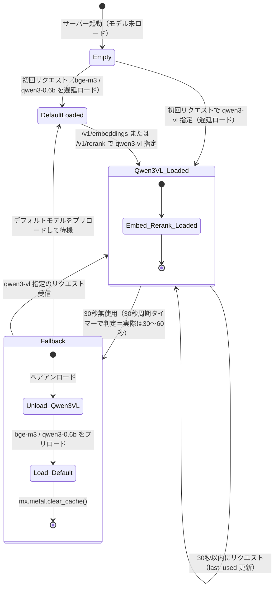
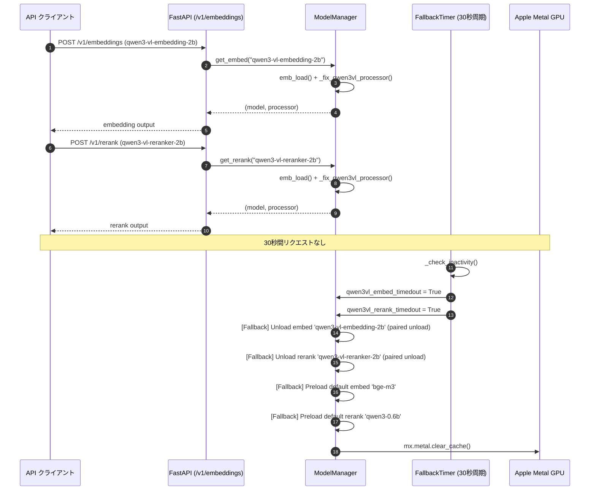

# MLX Embedding & Reranker Server

[English](README.md) | 日本語

Apple Silicon 向けにネイティブ最適化された **MLX** バックエンドで、
**Embedding / Rerank / STT（音声認識） / TTS（音声合成）** を
**1 つの FastAPI プロセス**で提供する軽量 API サーバーです。

LM Studio や Ollama などの LLM サーバーとは独立して常駐させ、
RAG（Retrieval-Augmented Generation）用の **Embedding / Rerank / 音声エンジン**として利用することを想定しています。

### 🚀 デフォルトモデル
`model` パラメータを省略した場合に使われるモデルです。選定根拠は [BENCHMARK_REPORT.md](BENCHMARK_REPORT.md) の実測結果に基づきます。

- **Embedding**: `bge-m3`（*bge-m3-mlx-fp16*）
- **Reranker**: `qwen3-0.6b`（*Qwen3-Reranker-0.6B-mxfp8*）
- **ASR（STT）**: `qwen3-asr-1.7b-8bit`（*Qwen3-ASR-1.7B-8bit*）
- **TTS**: `qwen3-tts-0.6b-base-8bit`（*Qwen3-TTS-12Hz-0.6B-Base-8bit*）

モデルは**起動時ではなく初回リクエスト時に遅延ロード**されます。重い Qwen3-VL 系モデルが無使用でアンロードされた後は、デフォルトの Embedding / Rerank モデルが自動でプリロードされ、ウォーム状態で待機します。

---

## ✨ 特徴

- ✅ Embedding / Rerank / 音声を **1 プロセス**で提供（API ポート `1235`、ヘルス専用ポート `1236`）
- ✅ OpenAI 互換 API（`/v1/embeddings`, `/v1/audio/transcriptions`, `/v1/audio/speech`）
- ✅ Apple Silicon ネイティブの **MLX** による GPU 推論
- ✅ Embedding 5 モデル / Reranker 2 モデル / 音声 6 モデルをリクエスト単位で切り替え
- ✅ Qwen3-VL Embedding / Reranker 2B（`instruction` 対応。`torch` / `torchvision` が別途必要 → [動作環境](#-動作環境)）
- ✅ STT（`/v1/audio/transcriptions`）と、ボイスクローン対応 TTS（`/v1/audio/speech`）。TTS は Qwen3-TTS と日本語特化の Irodori TTS の 2 エンジン
- ✅ Qwen3-VL の自動アンロード + デフォルトモデルのプリロード（メモリ最適化）
- ✅ 推論中でも応答するヘルスチェック専用サーバー（別スレッド / 別ポート）
- ✅ GGUF 変換不要。MLX コミュニティの重みをそのまま利用
- ✅ OpenWebUI / Dify / LangChain / 自作 RAG パイプラインに接続可能

---

## 🧠 提供 API

### ベース URL

```
http://localhost:1235
```

ヘルスチェック専用サーバーが `http://localhost:1236` でも待ち受けます（→ [スーパーバイザー監視機能](#️-スーパーバイザー監視機能自動再起動)）。

> **注意:** 外部からのヘルスチェックには `http://localhost:1235/health` を使ってください。ポート `1236` は `run_mlx_server.sh` の内部ハング検知専用であり、クライアントやロードバランサーから使うものではありません。

### エンドポイント一覧

| Method | Path                    | 内容 |
|------|--------------------------|------|
| GET  | `/health`               | ロード済み／利用可能モデルを含むヘルスチェック |
| POST | `/v1/embeddings`        | **テキスト**の埋め込み生成（OpenAI 互換） |
| POST | `/v1/rerank`（別名 `/rerank`） | クエリと文書群のリランク |
| POST | `/v1/audio/transcriptions` | 音声ファイルの文字起こし（STT、OpenAI 互換） |
| POST | `/v1/audio/speech`      | テキストからの音声合成（TTS、OpenAI 互換） |

> **注意**: 画像入力は HTTP API では公開していません。Qwen3-VL 系モデルもテキスト専用の Embedding / Rerank として提供されます（`input` は文字列または文字列配列のみ）。

### `GET /health`

```json
{
  "status": "ok",
  "loaded_embed_models": [], "loaded_rerank_models": [],
  "loaded_asr_models": [], "loaded_tts_models": [],
  "available_embed": ["gemma-3-300m", "bge-m3", "bge-m3-8bit", "qwen3-vl-embedding-2b", "qwen3-0.6b-embed"],
  "available_rerank": ["qwen3-0.6b", "qwen3-vl-reranker-2b"],
  "available_audio": ["qwen3-asr-0.6b-8bit", "qwen3-asr-1.7b-8bit", "qwen3-tts-0.6b-base-8bit", "qwen3-tts-1.7b-base-8bit",
                      "irodori-tts-v4.1-small-8bit", "irodori-tts-v4.1-small-fp16"]
}
```

### `POST /v1/embeddings`

| フィールド | 型 | デフォルト | 説明 |
|:---|:---|:---|:---|
| `input` | `string \| string[]` | 必須 | 埋め込み対象のテキスト |
| `model` | `string` | `bge-m3` | Embedding モデル ID |
| `input_type` | `"query" \| "document"` | `"document"` | `gemma-3-300m` の自動プレフィックス、`qwen3-vl-embedding-2b` の既定 instruction を切り替え |
| `instruction` | `string` | `null` | **`qwen3-vl-embedding-2b` 専用**。他の Embedding モデルでは無視されます |

**出力ベクトルの仕様**: すべての Embedding モデルで `last_hidden_state` の先頭トークン（CLS プーリング）を取り出し、L2 正規化した単位ベクトルを返します。これは BGE-M3 の dense embedding の仕様に一致しており、`bge-m3` をデフォルトかつ日本語 RAG の推奨としている理由です（→ [モデル選定の指針](#-モデル選定の指針)）。

### `POST /v1/rerank`（別名 `POST /rerank`）

| フィールド | 型 | デフォルト | 説明 |
|:---|:---|:---|:---|
| `query` | `string` | 必須 | 検索クエリ |
| `documents` | `string[]` | 必須 | 候補文書 |
| `model` | `string` | `qwen3-0.6b` | Reranker モデル ID |
| `top_k` | `int` | `10` | 返却件数。`0` を指定すると全件返却 |
| `instruction` | `string` | `null` | **`qwen3-vl-reranker-2b` 専用**。`qwen3-0.6b` は固定の Yes/No 判定プロンプトを使うため無視されます |

レスポンスは `{"model": ..., "results": [{"index": ..., "relevance_score": ...}, ...]}` でスコア降順です。`qwen3-0.6b` のスコアは `yes` / `no` トークンのロジットに対する softmax 確率のため絶対値は小さくなります。**順位**が信号であり、スコアの絶対値ではありません。

### エラー応答の挙動

| 状況 | エンドポイント | ステータス |
|:---|:---|:---|
| 未対応のモデル名 | `/v1/rerank`, `/v1/audio/*` | `400`（短い detail メッセージ） |
| 未対応のモデル名 | `/v1/embeddings` | `500`（`compute_embeddings` を包む catch-all ハンドラが内部の 400 ごと 500 に変換するため） |
| 推論の失敗 | `/v1/embeddings` | `500` + `detail` に Python トレースバック全文（ローカルデバッグ用途。ポートを外部公開しないこと） |
| 推論の失敗 | `/v1/rerank` | `500 Internal Server Error`（トレースバックなし。サーバーログを参照） |

---

## ⏱️ 自動フォールバック（Auto Fallback）

Mac のユニファイドメモリを節約するため、重い Qwen3-VL 系モデル（`qwen3-vl-embedding-2b` / `qwen3-vl-reranker-2b`）は **30 秒間未使用でアンロード**されます。

- **タイマー粒度**: 判定タイマーも 30 秒周期のため、実際の解放は最終リクエストから 30〜60 秒後になります。
- **ペアアンロード**: どちらか一方がタイムアウトしたら、Qwen3-VL の embed / rerank を**両方まとめて解放**します。
- **デフォルトのプリロード**: 同時に軽量なデフォルトモデル（`bge-m3` / `qwen3-0.6b`）をロードし、通常のリクエストに即応できる状態にします。
- **GPU メモリの即時解放**: アンロードとプリロードを終えた最後に `mx.metal.clear_cache()` を実行します。
- **音声モデルは対象外**: ASR / TTS モデルは一度ロードすると常駐します（0.6B / 1.7B 級は軽量なためアンロード不要と判断）。

### モデル状態遷移図


```mermaid
stateDiagram-v2
    [*] --> Empty : サーバー起動（モデル未ロード）
    Empty --> DefaultLoaded : 初回リクエスト（bge-m3 / qwen3-0.6b を遅延ロード）
    Empty --> Qwen3VL_Loaded : 初回リクエストで qwen3-vl 指定（遅延ロード）
    DefaultLoaded --> Qwen3VL_Loaded : /v1/embeddings または /v1/rerank で qwen3-vl 指定
    Qwen3VL_Loaded --> Qwen3VL_Loaded : 30秒以内にリクエスト（last_used 更新）
    Qwen3VL_Loaded --> Fallback : 30秒無使用（30秒周期タイマーで判定＝実際は30〜60秒）
    Fallback --> DefaultLoaded : デフォルトモデルをプリロードして待機
    Fallback --> Qwen3VL_Loaded : qwen3-vl 指定のリクエスト受信

    state Qwen3VL_Loaded {
        [*] --> Embed_Rerank_Loaded
        Embed_Rerank_Loaded --> [*]
    }

    state Fallback {
        [*] --> Unload_Qwen3VL : ペアアンロード
        Unload_Qwen3VL --> Load_Default : bge-m3 / qwen3-0.6b をプリロード
        Load_Default --> [*] : mx.metal.clear_cache()
    }
```

### フォールバックシーケンス図


```mermaid
sequenceDiagram
    autonumber
    participant Client as API クライアント
    participant API as FastAPI (/v1/embeddings)
    participant MM as ModelManager
    participant Timer as FallbackTimer (30秒周期)
    participant GPU as Apple Metal GPU

    Client->>API: POST /v1/embeddings (qwen3-vl-embedding-2b)
    API->>MM: get_embed("qwen3-vl-embedding-2b")
    MM->>MM: emb_load() + _fix_qwen3vl_processor()
    MM-->>API: (model, processor)
    API-->>Client: embedding output

    Client->>API: POST /v1/rerank (qwen3-vl-reranker-2b)
    API->>MM: get_rerank("qwen3-vl-reranker-2b")
    MM->>MM: emb_load() + _fix_qwen3vl_processor()
    MM-->>API: (model, processor)
    API-->>Client: rerank output

    Note over Client,GPU: 30秒間リクエストなし

    Timer->>Timer: _check_inactivity()
    Timer->>MM: qwen3vl_embed_timedout = True
    Timer->>MM: qwen3vl_rerank_timedout = True

    MM->>MM: [Fallback] Unload embed 'qwen3-vl-embedding-2b' (paired unload)
    MM->>MM: [Fallback] Unload rerank 'qwen3-vl-reranker-2b' (paired unload)
    MM->>MM: [Fallback] Preload default embed 'bge-m3'
    MM->>MM: [Fallback] Preload default rerank 'qwen3-0.6b'
    MM->>GPU: mx.metal.clear_cache()
```

### メモリ状態の比較

| 状態 | ロード済み Embed | ロード済み Rerank | メモリ使用量 | 次のリクエスト |
|------|-----------------|------------------|-------------|--------------|
| **起動直後（未ロード）** | なし | なし | 最小 | 初回は遅延ロード |
| **デフォルト待機** | `bge-m3` | `qwen3-0.6b` | 低（軽量） | 即座に応答 |
| **Qwen3-VL 使用中** | `qwen3-vl-embedding-2b` | `qwen3-vl-reranker-2b` | 高（重い） | 即座に応答 |
| **Qwen3-VL → フォールバック** | `bge-m3` | `qwen3-0.6b` | 低（解放済） | 即座に応答 |

※ ASR / TTS モデルは上表の遷移対象外で、一度ロードすると常駐します。

---

## 🔧 利用可能なモデル (MLX)

リクエスト時の `model` パラメータで切り替え可能です。未指定時はデフォルトモデルが使用されます。

### Embedding (デフォルト: `bge-m3`)

| モデル ID | Hugging Face モデル | 特徴 |
| :--- | :--- | :--- |
| `gemma-3-300m` | `embeddinggemma-300m-bf16` | 最速。`input_type` に応じたプレフィックスを自動付与 |
| `bge-m3` | `bge-m3-mlx-fp16` | 多言語で堅牢。**日本語 RAG の推奨・デフォルト** |
| `bge-m3-8bit` | `bge-m3-mlx-8bit` | BGE-M3 の 8bit 量子化版。省メモリ |
| `qwen3-0.6b-embed` | `Qwen3-Embedding-0.6B-mxfp8` | Qwen3 Embedding（テキスト専用） |
| `qwen3-vl-embedding-2b` | `Qwen3-VL-Embedding-2B-mxfp8` | 2B マルチモーダル。`instruction` 対応。最高精度・最重量 |

### Reranker (デフォルト: `qwen3-0.6b`)

| モデル ID | Hugging Face モデル | 特徴 |
| :--- | :--- | :--- |
| `qwen3-0.6b` | `Qwen3-Reranker-0.6B-mxfp8` | 生成型クロスエンコーダ（Yes/No ロジット）。高速・高精度 |
| `qwen3-vl-reranker-2b` | `Qwen3-VL-Reranker-2B-mxfp8` | 2B マルチモーダル。`instruction` 対応 |

### Audio (STT デフォルト: `qwen3-asr-1.7b-8bit` / TTS デフォルト: `qwen3-tts-0.6b-base-8bit`)

| モデル ID | Hugging Face モデル | 特徴 |
| :--- | :--- | :--- |
| `qwen3-asr-0.6b-8bit` | `Qwen3-ASR-0.6B-8bit` | 音声認識。最速（リアルタイム比 65.8x） |
| `qwen3-asr-1.7b-8bit` | `Qwen3-ASR-1.7B-8bit` | 音声認識。最高精度（43.9x、デフォルト） |
| `qwen3-tts-0.6b-base-8bit` | `Qwen3-TTS-12Hz-0.6B-Base-8bit` | 音声合成・ボイスクローン。ロードが速い（デフォルト） |
| `qwen3-tts-1.7b-base-8bit` | `Qwen3-TTS-12Hz-1.7B-Base-8bit` | 音声合成。話速が最も安定 |
| `irodori-tts-v4.1-small-8bit` | `Irodori-TTS-v4.1-Small-8bit` | 日本語特化 TTS。ボイスクローン＋VoiceDesign＋出力長の自動推定を単一モデルで提供 |
| `irodori-tts-v4.1-small-fp16` | `Irodori-TTS-v4.1-Small-fp16` | 同上の fp16 版 |

4bit 版は評価の結果採用を見送り、音声モデルは 8bit に統一しています（[BENCHMARK_REPORT.md](BENCHMARK_REPORT.md) §5.6 / §6.5）。
Irodori は fp16 / 8bit の比較のため両方を登録しており、ベンチマーク後に整理する予定です。

**v4.1-Small の特徴**

- **単一チェックポイントで全機能**: ボイスクローン（`ref_audio`）、VoiceDesign（`instruct`）、出力長の自動推定を 1 モデルで兼ねます。v3 のように base 版と VoiceDesign 版を使い分ける必要がありません。
- **追加ダウンロードなし**: ModernBERT-ja-310m テキストエンコーダとそのトークナイザ、Semantic-DACVAE コーデックがリポジトリに同梱されています。
- **参照音声は最大 120 秒**: 複数クリップを配列で渡すと各クリップを個別にエンコードして連結します（1 本の長時間録音より学習時の形式に近い）。上限は `max_ref_seconds` で変更できます。
- **既知の癖**: `instruct` のみ（参照音声なし）の短文では、推定される長さがやや長めに出る傾向があります。

---

## 🎯 モデル選定の指針

ChromaDB に格納した日本語 1000 件での実測（[BENCHMARK_REPORT.md](BENCHMARK_REPORT.md) §2〜§4）:

| モデル | 1000件（キャッシュ後） | 1件あたり | 検索精度の所見 |
| :--- | ---: | ---: | :--- |
| `gemma-3-300m` | 2.93 秒 | 約 2.9 ms | 最速。正解文書が Top100 に入らないケースあり |
| `bge-m3` | 6.10 秒 | 約 6.1 ms | 同条件で **Recall 100%**。デフォルト |
| `qwen3-0.6b-embed` | 9.42 秒 | 約 9.4 ms | `gemma-3-300m` と同様に取りこぼしあり |
| `qwen3-vl-embedding-2b` | 37.74 秒 | 約 37.7 ms | Recall 100%。最重量 |

**基本方針**: 検索品質重視なら `bge-m3`（メモリが厳しければ `bge-m3-8bit`）で Embedding し、Top100 を `qwen3-0.6b` でリランク（100 件で約 2 秒）。`gemma-3-300m` は低レイテンシ優先かつ取りこぼしを許容できる用途、Qwen3-VL はオフラインの高精度評価向けです。

---

## 📊 パフォーマンス概要

| タスク | モデル | 実測値 |
| :--- | :--- | :--- |
| Embedding | `bge-m3` | 1000 件を 6.10 秒（キャッシュ後） |
| Rerank | `qwen3-0.6b` | Top100 を約 2.0 秒（約 20 ms/件） |
| STT | `qwen3-asr-1.7b-8bit` | 32.9 秒の音声を 0.75 秒（43.9x リアルタイム） |
| TTS | `qwen3-tts-0.6b-base-8bit` | 平均生成 2.89 秒（4.4x リアルタイム）。音声長は std≈0.54 でばらつく |
| TTS | `irodori-tts-v4.1-small-8bit` | 平均生成 3.96 秒（`num_steps=10` で 2.65 秒 / 5.3x）。**音声長は std=0.000 で完全に一定** |

計測条件・全試行の数値・精度比較は [BENCHMARK_REPORT.md](BENCHMARK_REPORT.md) を参照してください。

---

## 📦 ディレクトリ構成

```text
embed_reranker/
├── mlx_embed_rerank_server.py   # メインの FastAPI サーバー（API 1235 + ヘルス 1236）
├── run_mlx_server.sh            # 起動・プロセス管理・監視スクリプト
├── pyproject.toml               # 依存関係と uv 設定
├── README.md                    # ドキュメント（英語）
├── README_JA.md                 # ドキュメント（日本語）
├── GEMINI.md                    # AI エージェント向けのプロジェクト context
├── BENCHMARK_REPORT.md          # ベンチマーク結果（Embedding / Rerank / STT / TTS）
├── MIGRATION_SUMMARY.md         # uv / MLX 移行の履歴
├── AUTO_STARTUP_SUMMARY.md      # launchd 自動起動の設定
├── TTS_ENGINE_DESIGN.md         # TTS 二エンジン構成の設計・実装・テスト方針
├── PLAN_STT_TTS_REVIEW.md       # 音声エンドポイントの設計レビュー（実装前の記録）
├── TODO.md                      # 今後の検討事項
├── LICENSE                      # MIT License
├── scripts/
│   ├── rag_pipeline_chromadb.py # ChromaDB 連携の RAG ベンチマーク
│   └── benchmark_100_sentences.py
├── test-tools/                  # 単発確認用スクリプト
│   ├── test_mlx.py
│   └── test_infer.py
└── tests/                       # pytest による結合テスト（設計は tests/TEST_DESIGN.md）
    ├── TEST_DESIGN.md           # テスト設計書（スコープ・ケース一覧・マーカー・保守方針）
    ├── conftest.py              # fixture・マーカー・共通ヘルパー
    ├── test_health.py           # /health（1235）と監視プローブ（1236）
    ├── test_embeddings.py       # POST /v1/embeddings
    ├── test_rerank.py           # POST /v1/rerank・/rerank
    ├── test_audio.py            # POST /v1/audio/*（マーカー: audio）
    ├── test_errors.py           # エラー応答とバリデーション
    └── data/
        ├── test_cases.json      # 全期待値
        └── asr_output.txt
```

---

## 🐍 動作環境

- macOS（Apple Silicon 必須）
- Python **3.13（推奨）**
- Apple MLX
- **ffmpeg**（mp4/m4a/webm 等の音声処理用）: `brew install ffmpeg`
- **Qwen3-VL 系モデルを使う場合のみ `torch` / `torchvision`**
  `pyproject.toml` には含まれていません。未インストールの場合、`transformers` の `AutoImageProcessor` が例外を投げ、`qwen3-vl-embedding-2b` / `qwen3-vl-reranker-2b` へのリクエストは HTTP 500 になります。必要な場合は明示的に導入してください。

  ```bash
  uv pip install torch torchvision
  ```

  それ以外のモデル（bge-m3 / gemma / qwen3 embed・rerank / ASR / TTS）は torch なしで動作します。

---

## 📥 セットアップ

### 1. 依存関係インストール (uv 推奨)

```bash
uv sync
```

---

## ▶️ 起動方法

```bash
./run_mlx_server.sh
```

起動成功時：

```
Health-check server started on port 1236
Uvicorn running on http://0.0.0.0:1235
```

管理サブコマンド:

```bash
./run_mlx_server.sh status    # 稼働状況とロード済みモデル（1235 の /health を参照）
./run_mlx_server.sh restart
./run_mlx_server.sh kill      # ポート 1235 のプロセスを停止
```

### 🛡️ スーパーバイザー監視機能（自動再起動）

起動スクリプト `run_mlx_server.sh` は、フォアグラウンドに常駐するスーパーバイザーとして動作します。

- **ヘルスチェック専用ポート**: MLX 推論は同期的に uvicorn のイベントループをブロックするため、サーバーは別デーモンスレッドで `http.server` ベースの軽量ヘルスサーバーを **ポート 1236** に起動します。スーパーバイザーは 1235 ではなく `http://localhost:1236/health` を監視するため、長時間の TTS / ASR 推論をハングと誤判定しません（経緯: [BENCHMARK_REPORT.md](BENCHMARK_REPORT.md) §6.6。TTS の 10 回連続実行で誤再起動が発生した対策）。
- **監視間隔**: 30 秒ごと、curl のタイムアウトは 10 秒。
- **ハング検知と自動再起動**: 「2 回連続」失敗（約 60 秒無応答）でハングと判定し、ポート 1235 を掴んでいるプロセスを停止して再起動します。
- **Grace Period（猶予期間）**: 2 回の猶予により、Qwen3-VL などの重いモデルロード中の誤検知を防ぎます。
- **トレードオフ**: 監視対象は同一プロセス内の別スレッドのため、プロセスが生存していれば `ok` を返します。検知できるのはプロセスの死亡・応答不能であり、イベントループのみが詰まった状態ではありません。

### macOS での自動起動（launchd）

[AUTO_STARTUP_SUMMARY.md](AUTO_STARTUP_SUMMARY.md) を参照してください。`~/Library/LaunchAgents/com.norihito.embed-reranker.plist` がログイン時に本スクリプトを `KeepAlive` 付きで起動します。

---

## 🧪 動作確認（手動）

### Health Check

```bash
curl http://localhost:1235/health   # ロード済みモデルを含む詳細
curl http://localhost:1236/health   # スーパーバイザー用: {"status": "ok"}
```

### Embedding

```bash
curl http://localhost:1235/v1/embeddings \
  -H "Content-Type: application/json" \
  -d '{"input": "日本語Embeddingのテスト", "input_type": "query"}'
```

#### instruction 指定（Qwen3-VL モデル専用）

```bash
curl http://localhost:1235/v1/embeddings \
  -H "Content-Type: application/json" \
  -d '{
    "model": "qwen3-vl-embedding-2b",
    "input": ["テキスト1", "テキスト2"],
    "input_type": "document",
    "instruction": "Represent this document for retrieval."
  }'
```

### Rerank

```bash
curl http://localhost:1235/v1/rerank \
  -H "Content-Type: application/json" \
  -d '{
    "query": "SATA DOMのリカバリ手順",
    "documents": [
      "SATA DOMを交換してOSを再インストールする手順",
      "メモリ増設の手順",
      "RAID再構築の注意点"
    ],
    "top_k": 2
  }'
```

#### instruction 指定（Qwen3-VL モデル専用）

```bash
curl http://localhost:1235/v1/rerank \
  -H "Content-Type: application/json" \
  -d '{
    "model": "qwen3-vl-reranker-2b",
    "query": "猫の写真",
    "documents": ["犬の散歩", "猫の昼寝", "鳥の飛行"],
    "instruction": "Retrieve images or text relevant to the user'"'"'s query."
  }'
```

### 音声認識（STT）

```bash
# 音声ファイルの文字起こし（wav, mp3, mp4, m4a 等）
curl -X POST http://localhost:1235/v1/audio/transcriptions \
  -F file="@sample.wav" \
  -F model="qwen3-asr-1.7b-8bit" \
  -F language="ja"
```

アップロードされたバイト列は拡張子を保持したまま `/tmp` に一時ファイルとして書き出し、そのパスをモデルに渡します（m4a/mp4 は `moov` が末尾配置のため、パイプ入力ではシークできず ffmpeg が空配列を返すことへの対策）。一時ファイルは処理後に必ず削除されます。レスポンスは `{"text": "..."}` です。

### 音声合成（TTS）

```bash
# テキストから音声生成（mp3, wav, flac, ogg）
curl -X POST http://localhost:1235/v1/audio/speech \
  -H "Content-Type: application/json" \
  -d '{
    "input": "こんにちは。これはテストです。",
    "model": "qwen3-tts-0.6b-base-8bit",
    "voice": "Chelsie",
    "response_format": "mp3"
  }' \
  --output speech.mp3
```

`response_format` は mp3 → `audio/mpeg`、wav → `audio/wav`、flac → `audio/flac`、ogg → `audio/ogg` にマップされ、未知の値は `audio/mpeg` にフォールバックします。`voice` / `speed` / `ref_audio` / `ref_text` / `lang_code` / `max_tokens` は指定された場合のみモデルへ渡されます（`speed` は `1.0` 以外、`lang_code` は `auto` 以外のときのみ）。

| パラメータ | 既定値 | 説明 |
|---|---|---|
| `voice` | なし | 話者名（マルチスピーカーモデル向け。例: `Chelsie`, `Ethan`） |
| `speed` | `1.0` | 話速。`1.0` のときは渡されない |
| `lang_code` | `"auto"` | 言語コード（`japanese`, `english`, `chinese` など）。`auto` 以外を指定すると言語 ID がコーデックのプレフィルに載る |
| `max_tokens` | 自動 | 生成トークン数の上限。未指定時は下記のとおり自動設定 |

`max_tokens` を省略した場合、**ボイスクローン（ICL）では 8192** が自動で使われます。ICL は `split_pattern` によるテキスト分割を行わず入力全体を 1 回の生成で処理するため、mlx-audio 既定の 4096 では長文が途中で切れるためです（非 ICL 経路は `max_tokens` が「セグメントあたり」なので既定で足ります）。

#### ボイスクローン

```bash
# リファレンス音声から声をクローン
curl -X POST http://localhost:1235/v1/audio/speech \
  -H "Content-Type: application/json" \
  -d '{
    "input": "これはクローンされた声です。",
    "model": "qwen3-tts-0.6b-base-8bit",
    "ref_audio": "/path/to/reference.wav",
    "ref_text": "リファレンス音声の書き起こし",
    "response_format": "wav"
  }' \
  --output cloned.wav
```

`ref_audio` は**サーバーホスト上のパス**を指定します（クライアントからのアップロードは未実装）。参照音声は **5〜15 秒程度**を推奨します。長すぎると ICL エンコードに時間がかかります（[BENCHMARK_REPORT.md](BENCHMARK_REPORT.md) §6.5）。

#### Irodori TTS（日本語特化エンジン）

Irodori は Qwen3-TTS とは別のエンジンで、`generate()` の引数が異なります。**リファレンス音声だけでクローンでき、書き起こし（`ref_text`）は不要**です。v4.1-Small は単一モデルでクローンと VoiceDesign を兼ねます。

```bash
# ボイスクローン（書き起こし不要）
curl -X POST http://localhost:1235/v1/audio/speech \
  -H "Content-Type: application/json" \
  -d '{
    "input": "今日はいい天気ですね。",
    "model": "irodori-tts-v4.1-small-8bit",
    "ref_audio": "/path/to/reference.wav",
    "response_format": "wav"
  }' \
  --output cloned.wav

# VoiceDesign: 声質を言葉で指示する（リファレンス音声なし）
curl -X POST http://localhost:1235/v1/audio/speech \
  -H "Content-Type: application/json" \
  -d '{
    "input": "今日はいい天気ですね。",
    "model": "irodori-tts-v4.1-small-8bit",
    "instruct": "落ち着いた女性の声で、近い距離感でやわらかく自然に読み上げてください。",
    "response_format": "wav"
  }' \
  --output designed.wav

# 両方を併用: 声はクローンしつつ話し方を指示する
curl -X POST http://localhost:1235/v1/audio/speech \
  -H "Content-Type: application/json" \
  -d '{
    "input": "今日はいい天気ですね。",
    "model": "irodori-tts-v4.1-small-8bit",
    "ref_audio": ["/path/to/clip1.wav", "/path/to/clip2.wav"],
    "instruct": "深く傷つき、今にも泣き出しそうな様子。声が震えており、弱々しく話す。",
    "response_format": "wav"
  }' \
  --output styled.wav
```

`ref_audio` に**配列**を渡すと各クリップを個別にエンコードして連結します（合計 120 秒まで。1 本の長時間録音より学習時の形式に近い）。上限は `max_ref_seconds` で変更できます。

> **⚠️ 30 秒の上限に注意**
> Irodori は duration predictor の推定値を `min_seconds`〜`max_seconds`（既定 0.5〜30 秒）にクランプします。
> 30 秒を超える音声が必要な場合は `max_seconds` を明示的に引き上げてください。指定しないと
> **入力テキストが長くても 30.00 秒ちょうどで頭打ち**になります（[BENCHMARK_REPORT.md](BENCHMARK_REPORT.md) §8）。

**エンジン別のパラメータ対応**

| パラメータ | Qwen3-TTS | Irodori |
|:---|:---|:---|
| `ref_audio`（文字列） | ✅ `ref_text` と併用で ICL | ✅ 単体でクローン可能 |
| `ref_audio`（配列） | ❌ `400` | ✅ 複数クリップを連結（v4 の機能） |
| `ref_text` | ✅ ICL に必須 | ⚠️ 無視（警告ログのみ） |
| `voice` / `lang_code` / `max_tokens` | ✅ | ⚠️ 無視（警告ログのみ） |
| `speed` | ✅ そのまま渡す | ✅ `duration_scale = 1 / speed` に変換 |
| `instruct` | ❌ `400` | ✅ 声質を言葉で指示（v4.1 は常に利用可） |
| `seconds` | ❌ `400` | ✅ 出力長を秒で明示 |
| `duration_scale` | ❌ `400` | ✅ 推定長に対する倍率（>1 で長く） |
| `num_steps` | ❌ `400` | ✅ Euler ステップ数（既定 40。`6` 程度まで下げると高速） |
| `cfg_guidance_mode` | ❌ `400` | ✅ `independent`（既定） / `alternating`（メモリ約 1/3） |
| `max_ref_seconds` | ❌ `400` | ✅ 参照音声の上限秒（既定はモデルの 120 秒） |
| `min_seconds` / `max_seconds` | ❌ `400` | ✅ 推定長のクランプ範囲（既定 0.5〜30 秒）。**長文では既定の 30 秒で頭打ちになる** |

`voice` / `ref_text` を **400 にせず無視**しているのは、OpenAI 互換クライアントがこれらを無条件に送るためです。一方 `instruct` は、caption 条件を持たない Irodori 版（v2 / v3 base 等）を登録した場合に `400` を返します。黙って無視すると意図が達成されないためで、v4.1 は caption を持つので常に受け付けます。

---

## 🧪 テスト（自動）

サーバーを起動した状態で実行します。

```bash
# 依存関係を含めて同期
uv sync --extra dev

# テスト実行
uv run pytest tests/
```

すべて**稼働中サーバーに対する API 結合テスト**で、モックは使いません。設計方針・ケース一覧・意図的に対象外としている項目は [tests/TEST_DESIGN.md](tests/TEST_DESIGN.md) を参照してください。

| ファイル | 検証内容 |
| :--- | :--- |
| `tests/test_health.py` | `/health` のペイロード構造・デフォルトモデルの実在・ポート 1236 の監視プローブ |
| `tests/test_embeddings.py` | 全 5 モデルの次元数・単位ベクトル性・OpenAI 互換構造・デフォルトモデル・文字列/配列入力の等価性・決定性・`input_type` のプレフィックス挙動・`instruction` が VL 専用であること・意味的健全性 |
| `tests/test_rerank.py` | 両 Reranker のレスポンス構造・降順・期待 1 位・スコア範囲・`/rerank` エイリアス・`top_k`（既定/切り詰め/`0`=全件/超過）・空配列・決定性・`qwen3-0.6b` が `instruction` を無視すること |
| `tests/test_audio.py` | STT の JSON 構造・`/tmp` 一時ファイルの後始末・TTS の Content-Type と RIFF ヘッダ・デフォルトモデル・音声モデルが常駐すること |
| `tests/test_errors.py` | 非対称なエラーコード（embeddings は 500 / rerank・音声は 400）・種別違いモデル・422 バリデーション・404 |

マーカー（`pyproject.toml` に登録済み、`--strict-markers` 有効）:

```bash
uv run pytest tests/                  # 全件
uv run pytest tests/ -m "not audio"   # 遅い STT/TTS を除外
uv run pytest tests/ -m audio         # STT/TTS のみ
```

注意:

- 期待値は `tests/data/test_cases.json` に集約しています。`AVAILABLE_*_MODELS` にモデルを追加・削除した場合は `expected_embed_models` / `expected_rerank_models` / `expected_audio_models` を更新しないと `/health` のアサーションが失敗します。
- `vl` マーカーのテストは `torch` / `torchvision` が未導入なら自動 skip されます（→ [動作環境](#-動作環境)）。
- サーバーが起動していない場合、テストはエラーではなく skip になります。

---

## 💡 RAG 構成例

1. **Embed**: `/v1/embeddings`（`bge-m3`）で文書をベクトル化
2. **Retrieve**: ベクトル DB から上位 50〜100 件を取得
3. **Rerank**: `/v1/rerank`（`qwen3-0.6b`）で上位 10〜20 件に絞り込み
4. **Generate**: 絞り込んだ文書を LLM のコンテキストに渡す

### LLM サーバーとの共存

| 役割 | ポート / Base URL |
| :--- | :--- |
| **LLM サーバー**（LM Studio / Ollama） | `http://localhost:1234/v1` |
| **Embed & Rerank サーバー**（本リポジトリ） | `http://localhost:1235` |
| **ヘルス監視専用**（本リポジトリ） | `http://localhost:1236/health` |

---

## 📜 License / Credits

- **License**: MIT License（詳細は [LICENSE](LICENSE) を参照）
- Models: [mlx-community](https://huggingface.co/mlx-community) / Google / BAAI / Qwen
- Powered by [Apple MLX](https://github.com/ml-explore/mlx) and FastAPI

---

## 📝 変更履歴

### 2026-09-06 — TTS 品質評価と 30 秒上限の修正

- `scripts/eval_tts_quality.py` を追加。発音精度（CER）と声の再現度（話者類似度）を実素材で評価 → [BENCHMARK_REPORT.md](BENCHMARK_REPORT.md) §8
- **`min_seconds` / `max_seconds` を `SpeechReq` に追加**。未公開だったため **30 秒を超える音声を生成できなかった**（Irodori は推定長を既定 0.5〜30 秒にクランプする）
- 主な知見:
  - **`num_steps=10` は声の再現度を明確に損なう** — 3 話者すべてで最低、gihren では別話者の類似度すら下回った。§7 の 33% 高速化は品質とのトレードオフ
  - **Qwen3-1.7B は gihren で類似度 0.8967** と下限割れ。§7 に続き削除判断を補強
  - **fp16 と 8bit は品質では区別できない** — §7 で「8bit 優位」と書いたが、品質面では有意差なし。fp16 を落とす根拠は速度・メモリ・ディスクのみ
  - **Irodori は出力長を 17〜31% 過大に予測**し、余尺が伸ばし音になる場合がある。§7 の「決定論的」は「正しい」を意味しない

### 2026-09-06 — TTS 設計書の追加と再ベンチマーク

- [TTS_ENGINE_DESIGN.md](TTS_ENGINE_DESIGN.md) を追加。二エンジン構成の設計判断・実装・テスト戦略を記録
- `scripts/benchmark_tts.py` を追加し、Irodori v4.1（8bit / fp16）と Qwen3-TTS（0.6B / 1.7B）を同一条件で再測定 → [BENCHMARK_REPORT.md](BENCHMARK_REPORT.md) §7
- 主な知見:
  - **Irodori は出力長が完全に決定論的**（std=0.000）。Qwen3-TTS は 0.6B / 1.7B とも std≈0.55
  - **fp16 は 8bit より全指標で同等以下**（生成 +3%、RSS +567MB、ディスク +0.5GB）。数値上は 8bit 一本化が妥当
  - **`num_steps=10` で 33% 高速化**（3.96s → 2.65s）し、出力長は変わらない
  - **`qwen3-tts-1.7b-base-8bit` を残した根拠が再現せず**（§6 の std=0.255 → 今回 std=0.553）。削除候補
- ※ 音質・声の再現度は自動計測の対象外で、未評価です

### 2026-09-06 — Irodori を v4.1-Small に一本化

- Irodori の登録を **`irodori-tts-v4.1-small-8bit` / `-fp16` の 2 件に置き換え**、v2 / v3 / v3-VoiceDesign（計 6 件）を削除。音声モデルは計 6 件
- v4.1-Small は**単一チェックポイント**でボイスクローン・VoiceDesign（caption）・出力長の自動推定をすべて備えるため、base 版と VoiceDesign 版の使い分けが不要に
- `ref_audio` が**複数クリップの配列**を受け付けるように変更（各クリップを個別にエンコードして連結、合計 120 秒まで）。Qwen3-TTS に配列を渡した場合は `400`
- `max_ref_seconds`（参照音声の上限秒）を追加
- レジストリの `voice_design` フラグを `supports_caption` に改称。caption 条件の有無で `instruct` を受理・拒否する判定はレジストリ駆動のまま維持
- 依存関係を **`mlx-audio>=0.5.1`** に更新（v4 系のテキストエンコーダ対応は 0.4.7 以降。あわせて transformers 5.16.1 へ）

> v4.1 は ModernBERT-ja-310m を事前学習済みテキストエンコーダとして使うため、`mlx-audio` 0.4.4 では
> `IrodoriDiTConfig` が `text_encoder_type` などを認識できず、旧アーキテクチャで構築されて重みロードに失敗します。

### 2026-09-06 — Irodori TTS（日本語特化エンジン）の追加

- `AVAILABLE_AUDIO_MODELS` に Irodori TTS を **6 モデル**追加（v3 / v2 の fp16・8bit と、v3 VoiceDesign の fp16・8bit）。音声モデルは計 10 件
- `type: "tts_irodori"` として **Qwen3-TTS とは別エンジン**にディスパッチ。`generate()` の引数体系が異なるため、エンジンごとにパラメータを分離
- `SpeechReq` に `instruct` / `seconds` / `duration_scale` / `num_steps` / `cfg_guidance_mode` を追加
- Irodori は `ref_audio` 単体でクローンできるため、**`ref_text` は caption にマッピングしない**。caption（`instruct`）は声質を言葉で指示する VoiceDesign 専用の条件で、書き起こしとは別物
- `speed` は Irodori に存在しないため `duration_scale = 1 / speed` に変換
- パラメータ検証を `get_tts()` の**前**に移動し、不正リクエストで数 GB のモデルロードが走らないように変更
- duration predictor 非搭載の v2 で `seconds` 未指定の場合に警告ログを出力
- 依存関係の下限を `mlx-audio>=0.3.0` → **`>=0.4.4`**（Irodori は 0.4 系の機能）

### 2026-09-06 — Qwen3-TTS に `lang_code` / `max_tokens` を追加

- `POST /v1/audio/speech` に `lang_code`（既定 `"auto"`）と `max_tokens`（既定 未指定）を追加
- `max_tokens` 未指定かつボイスクローン（ICL）の場合、**自動で 8192** を設定。ICL は `split_pattern` によるテキスト分割を行わず入力全体を 1 回で生成するため、mlx-audio 既定の 4096 では長文が途中で切れていた

### 2026-06-26 — 音声モデルの 8bit 統一とヘルスチェック専用サーバー

- ASR デフォルトを `qwen3-asr-0.6b-8bit` → **`qwen3-asr-1.7b-8bit`** に変更（精度が大幅向上、速度ペナルティは +0.25 秒）
- TTS の 4bit 版（`Qwen3-TTS-12Hz-0.6B-Base-4bit`）を削除し、**8bit に統一**。デフォルトは `qwen3-tts-0.6b-base-8bit`
- MLX 推論中にスーパーバイザーが誤ってプロセスを再起動する問題への対策として、**ポート 1236 のヘルスチェック専用サーバー**をデーモンスレッドで追加。`run_mlx_server.sh` の監視先を 1235 → 1236 に変更
- 詳細な計測結果は [BENCHMARK_REPORT.md](BENCHMARK_REPORT.md) を参照

### 2026-06-26 — STT / TTS エンドポイントの追加

- `POST /v1/audio/transcriptions`（OpenAI 互換 STT）と `POST /v1/audio/speech`（OpenAI 互換 TTS、ボイスクローン対応）を追加
- `AVAILABLE_AUDIO_MODELS` と `ModelManager.get_asr()` / `get_tts()` を追加。ロードは `mlx_audio.stt.utils` / `mlx_audio.tts.utils` を使用
- `/health` に `loaded_asr_models` / `loaded_tts_models` / `available_audio` を追加
- 依存関係に `mlx-audio>=0.3.0` と `python-multipart` を追加
- 設計検討の記録は [PLAN_STT_TTS_REVIEW.md](PLAN_STT_TTS_REVIEW.md)（実装時に既定モデル等は変更されています）
- 二エンジン構成の設計判断は [TTS_ENGINE_DESIGN.md](TTS_ENGINE_DESIGN.md)

### 2026-06-20 — `bge-m3-8bit` の追加

- 省メモリ用途向けに `mlx-community/bge-m3-mlx-8bit` を `AVAILABLE_EMBED_MODELS` へ追加（Embedding は計 5 モデル）

### 2026-06-05 — Qwen3-VL Embedding / Reranker 2B 対応

**追加**: `mlx-community/Qwen3-VL-Embedding-2B-mxfp8` と `mlx-community/Qwen3-VL-Reranker-2B-mxfp8` をサポート。

- `AVAILABLE_EMBED_MODELS` / `AVAILABLE_RERANK_MODELS` に新モデルを登録
- `compute_embeddings` / `compute_rerank` に `instruction` パラメータと `qwen3_vl_*` タイプ対応を追加（`instruction` が効くのは Qwen3-VL 系のみ）
- `EmbReq` / `RerankReq` に `instruction` フィールドを追加
- `mlx_embeddings` が `Qwen3VLProcessor.__init__` をスキップする問題に対し、`AutoProcessor.from_pretrained` から `image_ids` / `video_ids` / `audio_ids` / `chat_template` をコピーする `_fix_qwen3vl_processor` を追加
- **自動フォールバック**: `ModelManager` に 30 秒タイマーを導入。Qwen3-VL モデルは未使用でペアアンロードし、デフォルトモデル（`bge-m3` / `qwen3-0.6b`）へ自動フォールバック
- Qwen3-VL 系の実行には `torch` / `torchvision` が必要（`pyproject.toml` には含まれないため個別導入）

### 2026-04-30 — reranker を mlx_lm に移行

**問題**: `mlx_embeddings.load()` で Qwen3-Reranker を読み込んでいたが、この API は embedding 専用で cross-encoder の `rank()`/`score()` を持たず、`/v1/rerank` が常に 500 エラーを返していた。

**修正**: `mlx_lm.load()` で言語モデルとして正しくロードし、yes/no ロジットスコアリングを実装。実装されているプロンプトは以下の通り（`instruction` は埋め込まれません）。

```python
prompt = (
    "<|im_start|>system\nJudge whether the Document meets the requirements based on the Query. "
    "Note that the answer can only be \"yes\" or \"no\".\n"
    "<|im_start|>user\n"
    f"<Query>: {query}\n<Document>: {doc}\n"
    "<|im_start|>assistant\n"
)

# 最終トークンの yes/no ロジットから確率を計算
logits = model(input_ids[None, :])
last_logits = logits[0, -1, :]
score = softmax(last_logits[yes_token_id], last_logits[no_token_id])
```

⸻
